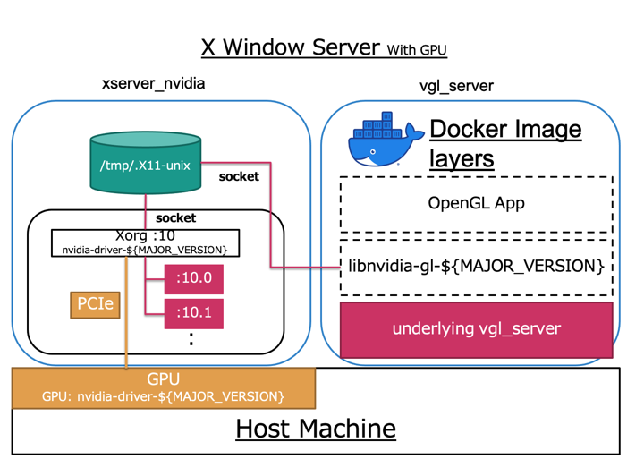

# underlying vgl_server


## Overview


vgl_server is used in combination with [vgl_client](https://github.com/rdbox-intec/vgl_client). Together, these two work as the core component of R2S2. A container that receives launch commands from vgl_client and rendered OpenGL App.



**This is an _underlying_ of vgl_server with no OpenGL related components installed.**  
You will need to implement the following components.

- libnvidia-gl-${MAJOR_VERSION}=${MAJOR_VERSION}${MINOR_BUILD_ETC}
  - All NVIDIA related components must have the same version.
  - .e.g libnvidia-gl-450=450.102.04-0ubuntu1
- An OpenGL App you want to run.
  - Unity App
  - glxgears
  - glmark2
  - , etc.

vgl_server is used in combination with [vgl_client](https://github.com/rdbox-intec/vgl_client). Together, these two work as the core component of R2S2. A container that receives launch commands from vgl_client and rendered OpenGL App.

## What is the underlying?

The underlying operations are listed below. Then, you stack docker images layers(libnvidia-gl, OpenGL App).

- Create a general user in a Docker container. (The user name is `ubuntu`)
- Configure X11 forwarding with SSH.
  - Change the port number.
- Download and install VirtualGL latest package.
  - [sourceforge.net](https://jaist.dl.sourceforge.net/project/virtualgl/)

## Usage

You need to mount two volumes.

- A SSH preivate key and configured authorized_keys.
- A Unix Domain socket of Xorg Xserve that supports OpenGL(GLX).

```bash
docker run -it --rm --privileged \
  -v /tmp/.rdbox.X11-unix:/tmp/.X11-unix \
  -v /home/ubuntu/.ssh:/etc/secret-volume \
  --name vgl-server \
  rdbox/vgl-server:v0.0.1
```

## Licence

[MIT](https://github.com/rdbox-intec/underlying_vgl_server/blob/main/LICENSE)